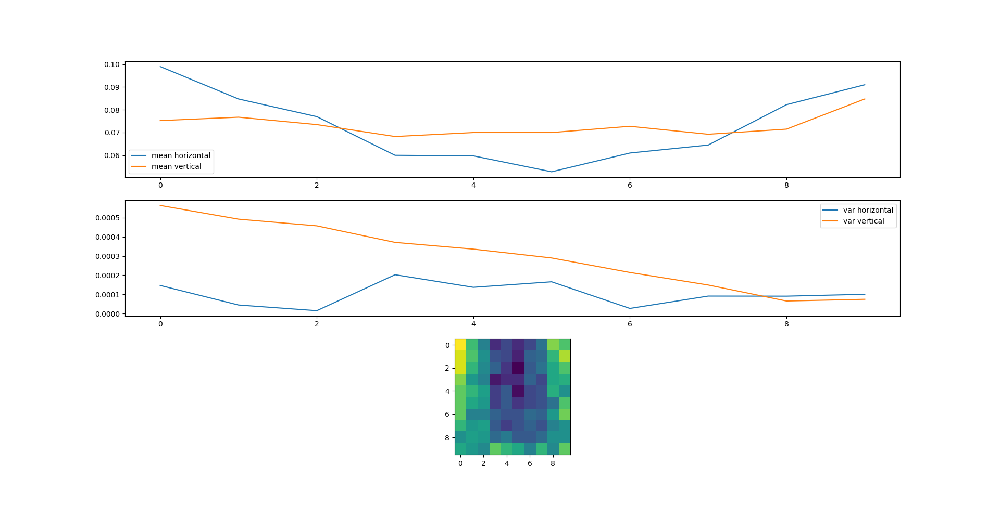

# Read 3D printer coefficients from data.txt
This is parsed from data.txt file. All measurements are in micrometers.


## How to run

```bash
$ pip install -r requirements.txt
$ python read_data.py
```

## Expected output

```bash
------ Coefficient from file [um]: ------
        0      |    1      |    2      |    3      |    4      |    5      |    6      |    7      |    8      |    9
0       117.50 |     92.50 |     72.50 |     47.50 |     55.00 |     47.50 |     55.00 |     67.50 |    102.50 |     95.00
1       112.50 |     95.00 |     77.50 |     57.50 |     55.00 |     45.00 |     62.50 |     65.00 |     90.00 |    107.50
2       112.50 |     90.00 |     75.00 |     62.50 |     50.00 |     37.50 |     60.00 |     67.50 |     85.00 |     95.00
3       102.50 |     80.00 |     72.50 |     42.50 |     47.50 |     47.50 |     62.50 |     55.00 |     85.00 |     87.50
4        97.50 |     90.00 |     82.50 |     52.50 |     60.00 |     40.00 |     55.00 |     57.50 |     87.50 |     77.50
5        97.50 |     85.00 |     80.00 |     52.50 |     60.00 |     50.00 |     55.00 |     57.50 |     67.50 |     95.00
6        97.50 |     72.50 |     72.50 |     62.50 |     57.50 |     57.50 |     65.00 |     62.50 |     80.00 |    100.00
7        90.00 |     80.00 |     82.50 |     60.00 |     52.50 |     57.50 |     62.50 |     57.50 |     72.50 |     77.50
8        77.50 |     82.50 |     80.00 |     65.00 |     70.00 |     60.00 |     60.00 |     65.00 |     77.50 |     77.50
9        85.00 |     80.00 |     75.00 |     97.50 |     90.00 |     85.00 |     72.50 |     90.00 |     75.00 |     97.50
Mean average value X:  0.073 Y: 0.073
Mean STD value X:  0.010 Y: 0.017

```
Plots mean and variance for each axis of 3d printer

